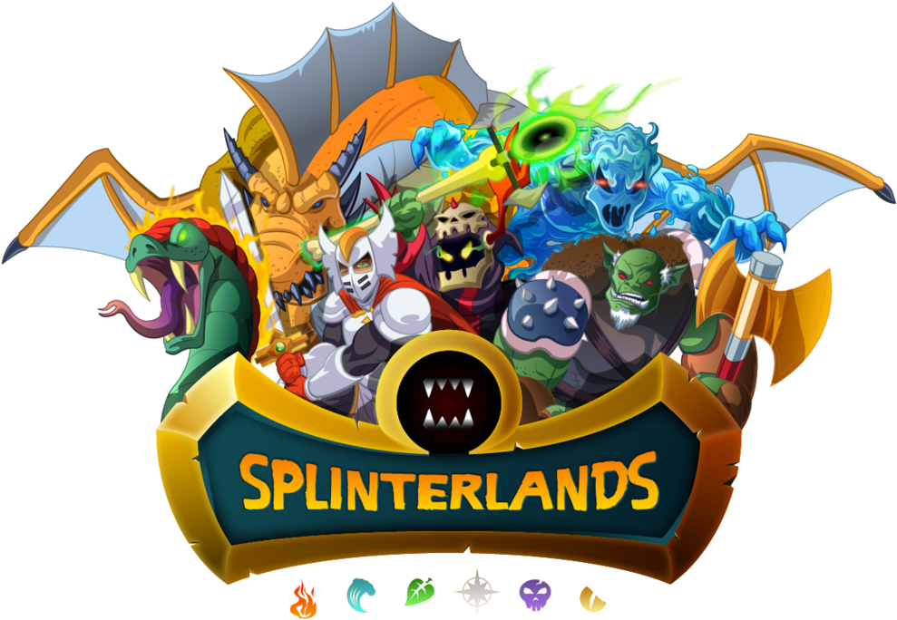

<h1 align="center">
  <a href="https://github.com/Edition-X/splinter-sniper">
    <!-- Please provide path to your logo here -->
    
  </a>
</h1>
<div align="center"><h1>splinter-sniper</h1></div>
<div align="center">
  <a href="https://hub.docker.com/r/danops/splinter-sniper"></a> <a href="https://github.com/Edition-X/splinter-sniper/releases/tag/v1.3.0-alpha"></a> <a href="https://github.com/Edition-X/splinter-sniper/stargazers"></a>
  <br />
  <a href="#about"><strong>Explore the docs »</strong></a>
  <br />
  <br />
  <a href="https://github.com/Edition-X/splinter-sniper/issues/new?assignees=&labels=bug&template=01_BUG_REPORT.md&title=bug%3A+">Report a Bug</a>
  ·
  <a href="https://github.com/Edition-X/splinter-sniper/issues/new?assignees=&labels=enhancement&template=02_FEATURE_REQUEST.md&title=feat%3A+">Request a Feature</a>
  .
  <a href="https://github.com/Edition-X/splinter-sniper/issues/new?assignees=&labels=question&template=04_SUPPORT_QUESTION.md&title=support%3A+">Ask a Question</a>
</div>

<div align="center">
<br />

[](LICENSE)

[](https://github.com/Edition-X/splinter-sniper/issues?q=is%3Aissue+is%3Aopen+label%3A%22help+wanted%22)
[](https://github.com/Edition-X)

</div>

<details open="open">
<summary>Table of Contents</summary>

- [About](#about)
- [Getting Started](#getting-started)
  - [Configuration](#configuration---configjson)
    - [Global Parameters](#global-parameters)
    - [Buy Configuration](#buy-configurations-buyconfigs)
- [Clone the repo](#clone-the-repo)
- [Run with docker-compose (Recommended)](#run-with-docker-compose-recommended)
- [Run with python3 locally](#run-with-python3-locally)
- [Roadmap](#roadmap)
- [Support](#support)
- [Project assistance](#project-assistance)
- [Contributing](#contributing)
- [Authors & contributors](#authors--contributors)
- [Security](#security)
- [License](#license)
- [Acknowledgements](#acknowledgements)

</details>

---

## About

A Python bot to monitor the Hive blockchain and snipe cards that are underprice.
> **[?]**
> Provide general information about your project here.
> What problem does it (intend to) solve?
> What is the purpose of your project?
> Why did you undertake it?
> You don't have to answer all the questions -- just the ones relevant to your project.

## Getting Started

### Configuration - config.json

Inside the config.json file you can set parameters for the bot.

You can set the following parameters:

#### Global Parameters

1. `currency`: Either "DEC" or "CREDITS".
   ```
   "currency": "DEC"
   ```

2. `auto_set_buy_price`: If this is set to true, the bot will check current market prices and bid accordingly, to buy underpriced cards.
    ```
    "auto_set_buy_price": "true"
    ```

3. `buy_pct_below_market`: Use this parameter in combination with "auto_set_buy_price":true
   This specifies how many percent below market price the bot should buy.

    **This is only active if "auto_set_buy_price":true**

    Example, buy 10% below current market price:
    ```
    "buy_pct_below_market": 10
    ```

5. `sell_pct_above_buy`: Use this parameter in combination with "auto_set_buy_price":true
   This specifies how many percent above buying price the bot should resell cards.

   **This is only active if "auto_set_buy_price":true, otherwise the bot uses the bids' individual "sell_for_pct_more**

    Example, sell for 15% more than buy price: 
    ```
    "sell_pct_above_buy": 15
    ```

6. `tip_pct_of_profit`: This specifies how many percent of your **profit** you want to send to me as a tip. This tipping occurs only if the bot successfully resells a card. So if for example you buy a card for 1$ and sell it for 1.2$ and this is set to 10%, the tip would amount to 0.02$ (10% of 0.2$ profit). 
   
   *In case you don't want to tip me, set this to 0.*

   Example, you love this bot, so you tip 50% of your profits: 
    ```
    "tip_pct_of_profit": 50
    ```
   
#### Buy configurations (buyconfigs)

1. `comment`: This field is there to name your bids. You can write whatever you want here, the bot will ignore it.
              
    Example:

    ```
    "comment": "I love Splinterlands"
    ```

2. `cards`: This specifies individual cards you want the bot to buy. For Example to buy Chicken, you would put ["131"].

     If you fill in this field, all other ones will be ignored, you can leave them empty.

     Example, only buy chicken:
      ```
      "cards": ["131"]
      ```
3. `editions`: This specifies the editions the bot will filter for. The keys are as following: 

   `alpha`

   `beta` 

   `promo`

   `reward` 

   `untamed`

   `dice`

   `chaos`

      Example, only buy alpha, beta, promo and untamed cards:
      ```
      "editions": ["alpha","beta","promo","untamed"]
      ```
4. `rarities`: This specifies the rarities the bot will filter for, formatted by the IDs as they appear in the Splinterlands API. The keys are as following: 

    `common`

    `rare`

    `epic`

    `legendary` 
 
     Example, only buy epic and legendary cards:
     
      ```
      "rarities": ["epic","legendary"]
      ```
5. `elements`: The bot can also filter for specific elements, like "fire", "death" or "dragon" 
   
   The keys are: 

   `fire`

   `water`

   `earth`

   `life`

   `death`

   `dragon`

   `neutral`

    Example, filter for dragon cards only:

    ```
    "elements": ["dragon"]
    ```
    
6. `types`: To filter for Summoners or Monsters. Values are:
   
   `summoner`

   `monster`

    Example, buy summoners and monsters:

    ```
    "types": ["summoner", "monster"]
    ```
    
7. `min_bcx`: To buy only cards with a bcx equal or higher than this parameter
   
    Example, buy cards with >= 5 bcx:

    ```
    "min_bcx": 5
    ```
    
8. `min_cp_per_usd`: To buy only cards with a specific CP/USD (Collection Power per USD)

    Example, buy cards with CP/USD >= 200:

    ```
    "min_cp_per_usd": 200
    ```

9. `max_price`: The maximum price in USD to buy the cards. Everything cheaper than this price will be bought by the bot.

     Example, buy everything under 69.420 USD:
     
      ```
      "max_price": 69.42
      ```
10. `max_quantity`: How many cards the bot should buy for this specific bid

    Example, buy 5 cards:

      ```
      "max_quantity": 5
      ```
11. `gold_only`: If this is set to true, the bot will only  buy gold foil cards.

    Example, buy only gold foil cards:
  
      ```
      "gold_only": true
      ```
12. `exclude_cl`: This parameter is meant to be paired with filtering for Reward Edition cards, because these cards cannot be filtered by edition, but Chaos Legion cards are worth significantly less atm. If this is set to true, the bot will NOT buy any cards released with ID > 330.
 
     Example, don't buy CL (reward) cards:

      ```
      "exclude_cl": true
      ```

13. `sell_for_pct_more`: If you want the bot to put the cards on the market immediately after buying, you can use this parameter. The bot will sell the card for x   percent more than the buy price. For example, if the card is bought for 10$ and "buy_for_pct_more" is set to 10, the bot will list the card for 11$

     **If you don't want the bot to sell automatically, leave this parameter at 0**
     **This is only active if "auto_set_buy_price":false, otherwise it is ignores and the global parameter is used**

     Example, sell for 10% higher than buy price:

      ```
      "sell_for_pct_more": 10
      ```

     Example 2, don't sell cards:

      ```
      "sell_for_pct_more": 0
      ```

### Clone the repo

Download [Git](https://git-scm.com/) and clone the repo: 
```
git clone https://github.com/edition-x/splinter-sniper.git
```
     
Go to repo directory:
```
cd splinter-sniper
```

### Run with docker-compose (Recommended)

```
docker-compose up -d
```

## Run with python3 locally

Create and activate a virtual environment:
```
python3 -m venv venv
source venv/bin/activate
```

Set environment variables for HIVE_USERNAME & HIVE_ACTIVE_KEY
```
export HIVE_USERNAME=edition-x
export HIVE_ACTIVE_KEY=<YOUR_ACTIVE_KEY>
```

Install the requirements
```
python3 -m pip install -r requirements.txt
```

Run the script:
```
python3 main.py
```
<br />
<hr />

## Roadmap

See the [open issues](https://github.com/Edition-X/splinter-sniper/issues) for a list of proposed features (and known issues).

- [Top Feature Requests](https://github.com/Edition-X/splinter-sniper/issues?q=label%3Aenhancement+is%3Aopen+sort%3Areactions-%2B1-desc) (Add your votes using the 👍 reaction)
- [Top Bugs](https://github.com/Edition-X/splinter-sniper/issues?q=is%3Aissue+is%3Aopen+label%3Abug+sort%3Areactions-%2B1-desc) (Add your votes using the 👍 reaction)
- [Newest Bugs](https://github.com/Edition-X/splinter-sniper/issues?q=is%3Aopen+is%3Aissue+label%3Abug)

## Support

> **[?]**
> Provide additional ways to contact the project maintainer/maintainers.

Reach out to the maintainer at one of the following places:

- [GitHub issues](https://github.com/Edition-X/splinter-sniper/issues/new?assignees=&labels=question&template=04_SUPPORT_QUESTION.md&title=support%3A+)
- Contact options listed on [this GitHub profile](https://github.com/Edition-X)

## Project assistance

If you want to say **thank you** or/and support active development of splinter-sniper:

- Add a [GitHub Star](https://github.com/Edition-X/splinter-sniper) to the project.
- Tweet about the splinter-sniper.
- Write interesting articles about the project on [Dev.to](https://dev.to/), [Medium](https://medium.com/) or your personal blog.

Together, we can make splinter-sniper **better**!

## Contributing

First off, thanks for taking the time to contribute! Contributions are what make the open-source community such an amazing place to learn, inspire, and create. Any contributions you make will benefit everybody else and are **greatly appreciated**.


Please read [our contribution guidelines](docs/CONTRIBUTING.md), and thank you for being involved!

## Authors & contributors

The original setup of this repository is by [Daniel Kelly](https://github.com/Edition-X).

For a full list of all authors and contributors, see [the contributors page](https://github.com/Edition-X/splinter-sniper/contributors).

## Security

splinter-sniper follows good practices of security, but 100% security cannot be assured.
splinter-sniper is provided **"as is"** without any **warranty**. Use at your own risk.

_For more information and to report security issues, please refer to our [security documentation](docs/SECURITY.md)._

## License

This project is licensed under the **GNU General Public License v3**.

See [LICENSE](LICENSE) for more information.

## Acknowledgements

> **[?]**
> If your work was funded by any organization or institution, acknowledge their support here.
> In addition, if your work relies on other software libraries, or was inspired by looking at other work, it is appropriate to acknowledge this intellectual debt too.
